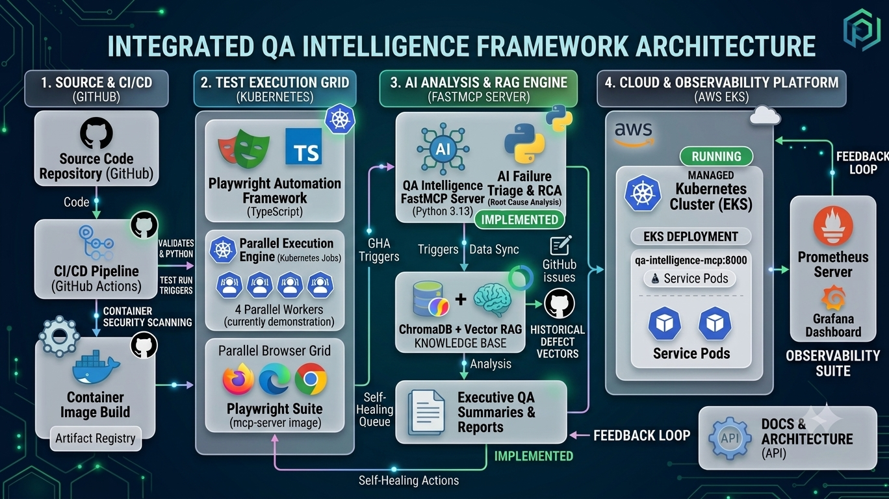
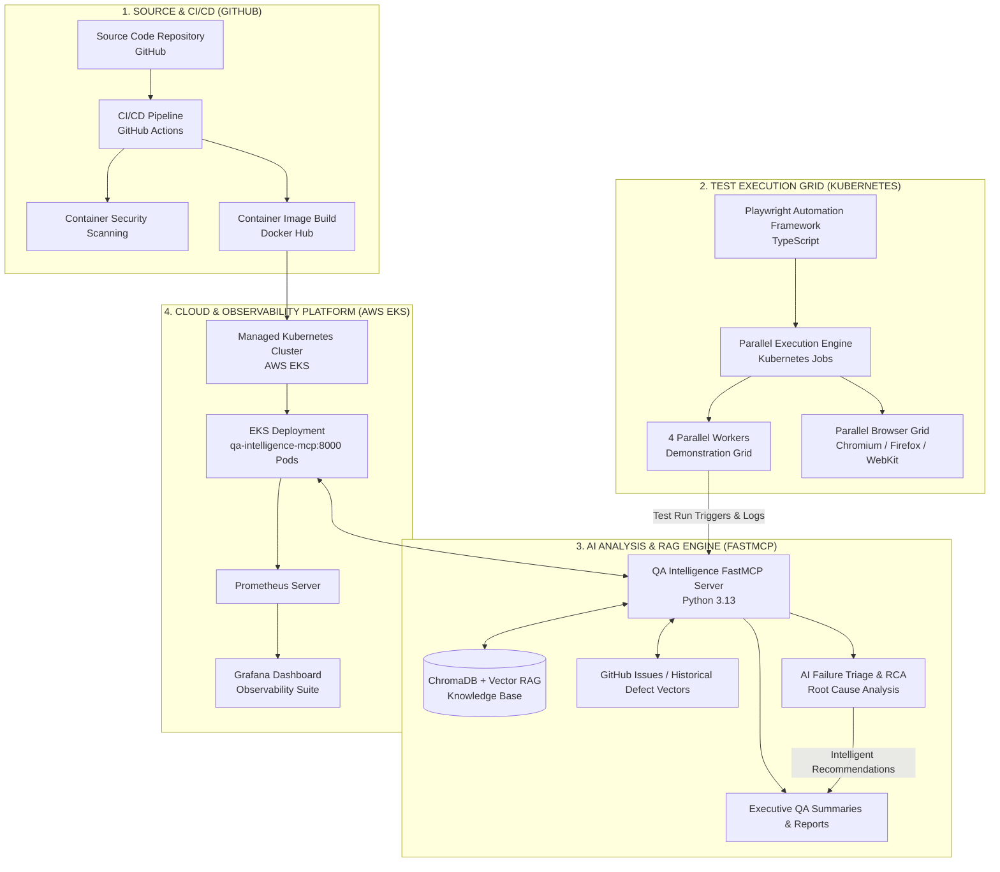
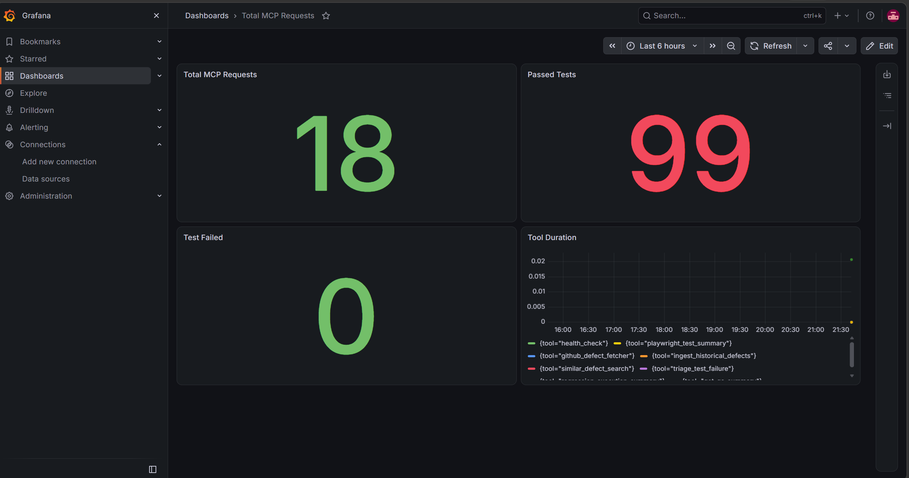

# 🚀 AI-Powered Cloud-Native QA Intelligence Platform

> **Intelligent Regression Analysis • AI Failure Triage • RAG • Observability**

An end-to-end QA Intelligence platform that transforms traditional regression testing into an AI-assisted engineering workflow using **Playwright**, **FastMCP**, **ChromaDB**, **GitHub Intelligence**, **Prometheus**, and **Grafana**.

From **Failed Test** ➔ **Root Cause Analysis (RCA)** ➔ **Similar Defects** ➔ **Executive QA Summary** ➔ **Live Observability**.

---

## 🎯 Why This Project?

Traditional automation often stops at deterministic pass/fail reporting:

```
Test Fails ➔ Report Generated ➔ Manual Investigation ➔ Search Historical Defects ➔ Root Cause Analysis ➔ Fix ➔ Re-run
```

**QA Intelligence Platform** unifies execution, historical knowledge, and real-time observability:

```
Test Execution ➔ Report Aggregation ➔ Semantic Defect Search ➔ AI Failure Triage ➔ Regression Analytics ➔ Executive QA Summary
```

> **Engineering Principle:**  
> **Automation** = Source of Truth  
> **AI Layer** = Investigation Assistant  
> AI-assisted output supports engineering decisions without replacing deterministic test execution results.

---

## ✨ Engineering Highlights

* **8 Production-Ready MCP Tools:** Standardized endpoints exposed over Streamable HTTP via FastMCP.
* **Distributed Report Aggregation:** Merges parallel Playwright test reports across test execution runs.
* **AI-Powered Failure Triage:** Contextual root-cause analysis integrating GitHub issues and ChromaDB vectors.
* **Semantic Defect Retrieval:** Vector embeddings for historical defect lookup using RAG.
* **Executive QA Summaries:** Automated high-level reporting designed for engineering leadership and stakeholders.
* **Real-Time Observability:** Metric exporting to Prometheus and visual monitoring with Grafana.
* **Cloud-Native Architecture:** Fully containerized with Docker, deployable via Kubernetes manifests to AWS EKS.

---

## 🏗️ Platform Architecture

### Visual Architecture


### Architectural Flow (Mermaid Diagram)



---

## 📊 Live Observability



| Metric | Value | Description |
| :--- | :--- | :--- |
| **MCP Requests** | `18` | Total HTTP FastMCP server tool invocation calls |
| **Passed Tests** | `99` | Cumulative passed test execution count across runs |
| **Failed Tests** | `0` | Active unaddressed regression failures |
| **Observability Stack** | `Prometheus + Grafana` | Real-time system performance and execution metrics |

---

## 🛠️ MCP Tool Suite

| Tool | Category | Purpose |
| :--- | :--- | :--- |
| `health_check` | System | Verify server readiness and availability |
| `playwright_test_summary` | Automation | Parse and analyze raw Playwright JSON reports |
| `github_defect_fetcher` | Integration | Retrieve active and closed GitHub defect issues |
| `ingest_historical_defects` | Vector Store | Convert defect history into ChromaDB embeddings |
| `similar_defect_search` | Intelligence | Semantic similarity lookup for historical defects |
| `triage_test_failure` | Intelligence | AI-assisted failure triage and root cause analysis |
| `regression_execution_summary` | Analytics | Summarize test run metrics across environments |
| `get_qa_summary` | Executive | Generate executive-level insights for stakeholders |

---

## 🧰 Technology Stack

* **Automation Framework:** Playwright (TypeScript)
* **AI & Protocols:** FastMCP, Model Context Protocol, ChromaDB (Vector Store)
* **Backend Application:** Python 3.13, Uvicorn
* **Observability & Monitoring:** Prometheus, Grafana
* **DevOps & Infrastructure:** Docker, Docker Hub, Kubernetes, AWS EKS
* **Integrations & CI/CD:** GitHub Actions, GitHub REST API, Pytest

---

## 📂 Repository Structure

```text
qa-intelligence-mcp/
├── .github/
│   └── workflows/
│       ├── ci.yml                 # Python & Playwright validation
│       └── docker-publish.yml     # Container build & release
├── aggregator/
│   └── merge_reports.py           # Merges JSON/HTML test outputs
├── docs/
│   ├── architecture.md            # Comprehensive system docs
│   ├── architecture.png           # Architecture diagram image
│   └── grafana-dashboard.png      # Observability dashboard screenshot
├── k8s/
│   ├── deployment.yaml            # MCP Server K8s Deployment & Service
│   └── job.yaml                   # Parallel regression execution job specs
├── monitoring/
│   ├── prometheus.yml             # Prometheus scrape configuration
│   └── grafana-dashboard.json     # Live observability dashboard export
├── playwright-demo/
│   ├── tests/                     # Playwright regression test cases
│   ├── package.json
│   └── playwright.config.ts
├── src/
│   └── qa_mcp_server/
│       └── tools/
│           ├── github.py          # GitHub issue integration
│           ├── playwright.py      # Playwright report analyzer
│           ├── rag.py             # ChromaDB vector operations
│           ├── report_analyzer.py # Data consolidation tools
│           └── triage.py          # AI Root Cause Analysis engine
├── tests/                         # Unit tests for MCP tools
├── Dockerfile                     # Cloud-native build instructions
├── requirements.txt               # Python dependencies
├── server.py                      # FastMCP server entry point
└── README.md
```

---

## 🚀 Getting Started

### 1. Local Environment Setup

**Python Server Setup:**
```bash
python -m venv .venv
# On Windows: .venv\Scriptsctivate | On macOS/Linux: source .venv/bin/activate
pip install -r requirements.txt
pytest -q
```

**Playwright Suite Setup:**
```bash
cd playwright-demo
npm ci
npx playwright install
npx playwright test
cd ..
```

**Launch MCP Server:**
```bash
python server.py
# Server runs on http://127.0.0.1:8000/mcp
```

---

### 2. Docker Containerization

**Build and Run Locally:**
```bash
docker build -t qa-intelligence-mcp:latest .
docker run -p 8000:8000 qa-intelligence-mcp:latest
```

**Multi-Architecture Build (AWS EKS x86_64 Support):**
```bash
docker buildx build \
  --platform linux/amd64 \
  -t lethalfore/qa-intelligence-mcp:1.1.0 \
  --push .
```

---

### 3. Kubernetes & Cloud Deployment (AWS EKS)

```bash
# Apply deployment and service
kubectl apply -f k8s/deployment.yaml

# Trigger parallel regression jobs
kubectl apply -f k8s/job.yaml

# Check cluster state
kubectl get deployment
kubectl get pods
kubectl get svc qa-intelligence-service

# Stream logs
kubectl logs -f deployment/qa-intelligence-mcp
```

---

## 🧠 Architectural Decisions

* **Model Context Protocol (FastMCP):** Keeps QA tools modular and decoupled. AI agents interact with dedicated, deterministic functions rather than parsing unstructured prompts.
* **Retrieval-Augmented Generation (RAG):** Uses historical defect context from ChromaDB to prevent repeating past investigation work when identical or similar failures occur.
* **Separation of Workloads:** Long-running FastMCP service runs as a standard `Deployment`, while finite test suites run as isolated Kubernetes `Jobs`.

---

## 🔐 Engineering Principles

```
Deterministic Test Execution
            +
Historical Defect Context
            +
AI-Assisted Root Cause Analysis
            +
Observability & Reporting
```

* **Automation = Source of Truth**
* **AI = Investigation Assistant**

---

## ⚠️ Current Limitations & Future Enhancements

### Implemented
* FastMCP Server with 8 active tools
* ChromaDB vector ingestion and semantic defect search
* Playwright report aggregator
* Prometheus & Grafana observability integration
* Docker Hub multi-arch build pipeline
* Kubernetes Deployment, Service, and Job specs for AWS EKS

### Next Extensions
* Persistent distributed test artifact store (S3 / MinIO)
* Automated failure ➔ fix recommendation ➔ re-trigger pipeline loop
* Autonomous test flakiness predictive modeling
* Istio Service Mesh integration for advanced cluster traffic routing

---

## 💼 Business Impact

* **Reduced MTTR (Mean Time to Resolution):** Cuts down triage time by correlating new test failures against known GitHub bugs and past vector-indexed defects.
* **Executive Visibility:** Automated generation of concise, high-level summaries for engineering leadership.
* **Operational Insight:** Full stack observability mapping test execution counts, HTTP activity, and pass/fail distributions directly to Grafana dashboards.
