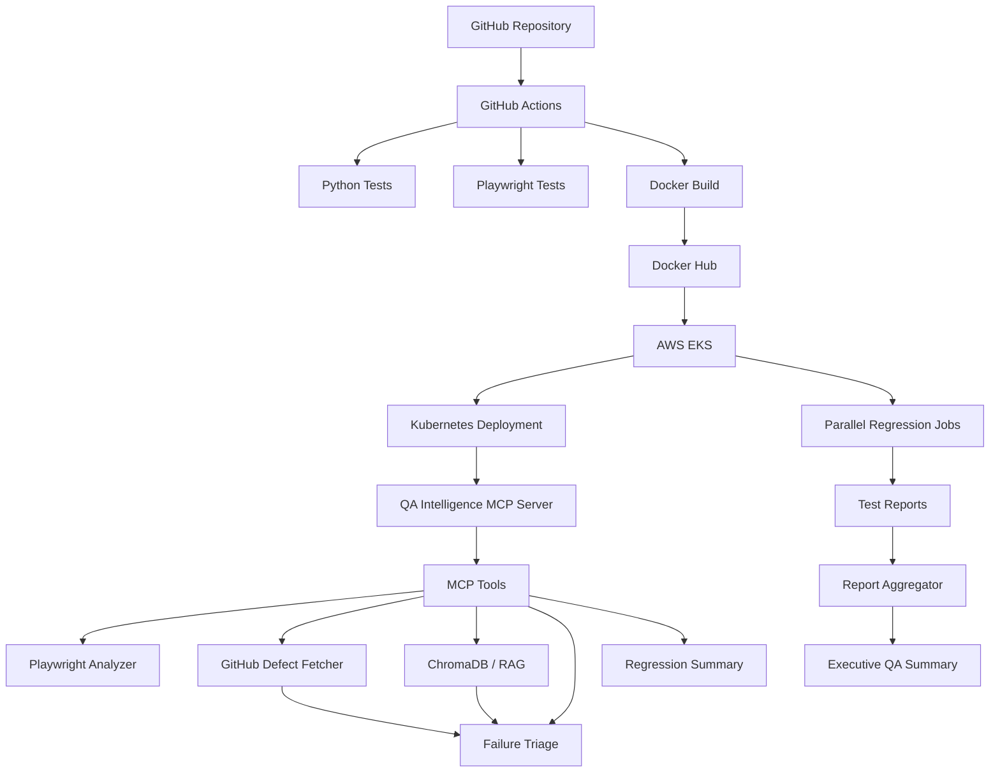

# 🚀 QA Intelligence MCP

AI-powered, cloud-native QA intelligence platform that connects Playwright automation, AI-assisted failure analysis, RAG-based historical defect search, GitHub defect intelligence, distributed reporting, CI/CD, Docker, Kubernetes, and AWS EKS.

---

## 🎯 Why this project?

Traditional automation often stops at:

```text
Test fails
   ↓
Report generated
   ↓
Engineer manually investigates
   ↓
Searches historical defects
   ↓
Determines RCA
   ↓
Fixes
   ↓
Re-runs
```

QA Intelligence connects the investigation workflow into a unified engineering platform:

```text
Test Execution
      ↓
Structured Results
      ↓
Historical Defect Search
      ↓
AI-Assisted Triage
      ↓
Regression Analytics
      ↓
Executive QA Summary
```

The goal is **not** to replace deterministic automation with AI.

AI is used where it adds value: investigation, contextual analysis, historical comparison, and engineering decision support.

---

# 🏗️ Architecture

## Visual Architecture


## Mermaid Architecture



Detailed architecture:

[View detailed architecture →](docs/architecture.md)

---

# 🔄 Platform Flow

```text
GitHub
   ↓
GitHub Actions
   ├── Python / Pytest
   └── Playwright / TypeScript
   ↓
Docker Build
   ↓
Docker Hub
   ↓
AWS EKS
   ↓
Kubernetes Deployment
   ↓
QA Intelligence MCP Server
   ├── Playwright Analyzer
   ├── GitHub Defect Fetcher
   ├── ChromaDB / RAG
   ├── Similar Defect Search
   ├── Failure Triage
   └── Regression Summary
                    ↓
             Report Aggregator
                    ↓
          Executive QA Summary
```

---

# 🧩 Four Integrated Layers

## 1. Source & CI/CD

```text
GitHub
   ↓
GitHub Actions
   ├── Python / Pytest
   └── Playwright / TypeScript
   ↓
Docker Build
   ↓
Docker Hub
```

GitHub Actions validates the Python MCP server and Playwright automation project.

The Docker publishing workflow builds and publishes the container image to Docker Hub.

---

## 2. Test Execution & Kubernetes Orchestration

The platform uses:

- Playwright
- TypeScript
- Kubernetes Jobs
- Parallel worker orchestration
- Structured regression reports

The Kubernetes Job configuration demonstrates parallel execution using:

```yaml
completions: 4
parallelism: 4
```

> **Current limitation:** the Kubernetes regression workers are currently demonstration workers rather than production Playwright execution containers.

---

## 3. AI Analysis & RAG

The Python MCP server exposes QA capabilities as explicit tools.

```text
Test Failure
     ↓
MCP Failure Triage
     ↓
 ┌───────────────┐
 │               │
 ▼               ▼
GitHub        ChromaDB
Defects          RAG
 │               │
 └───────┬───────┘
         ▼
Historical Context
         ↓
Failure Triage / RCA
```

ChromaDB is used to store and retrieve historical defect information using semantic similarity.

This allows a current failure to be compared against previously observed defects.

---

## 4. Cloud & Reporting

The application is containerized and deployed to AWS EKS.

```text
Docker Hub
    ↓
AWS EKS
    ↓
Kubernetes Deployment
    ↓
QA Intelligence MCP Server
    ↓
Kubernetes Service :8000
```

Regression reporting follows:

```text
Regression Workers
        ↓
    Test Reports
        ↓
 Report Aggregator
        ↓
merged-report.json
        ↓
Regression Summary
        ↓
Executive QA Summary
```

---

# 🤖 MCP Tools

The MCP server currently exposes:

| Tool | Purpose |
|---|---|
| `health_check` | Verify server availability |
| `playwright_test_summary` | Analyze Playwright JSON results |
| `github_defect_fetcher` | Retrieve GitHub defect issues |
| `ingest_historical_defects` | Ingest defects into ChromaDB |
| `similar_defect_search` | Find semantically similar defects |
| `triage_test_failure` | Perform AI-assisted failure triage |
| `regression_execution_summary` | Generate executive regression summary |

---

# 🔍 Intelligent Failure Triage

The core intelligence workflow is:

```text
Failure
   ↓
triage_test_failure
   ↓
GitHub Defect Search
   +
ChromaDB Semantic Search
   ↓
Historical Engineering Context
   ↓
Failure Triage / RCA
```

The system combines current failure information with historical context to assist engineering investigation.

The AI layer is an **investigation assistant**, while deterministic automation remains the source of truth.

---

# 📊 Reporting

The reporting pipeline is:

```text
Parallel Regression Workers
          ↓
      Test Reports
          ↓
    Report Aggregator
          ↓
    merged-report.json
          ↓
Regression Summary MCP Tool
          ↓
   Executive QA Summary
```

Example aggregated result:

```text
Total Tests : 50
Passed      : 47
Failed      : 3
Flaky       : 0
Pass Rate   : 94.0%
```

---

# 🛠️ Technology Stack

| Layer | Technology |
|---|---|
| UI Automation | Playwright |
| Test Language | TypeScript |
| MCP Server | Python + FastMCP |
| AI Tool Interface | Model Context Protocol |
| Vector Store | ChromaDB |
| RAG | Semantic defect retrieval |
| Defect Intelligence | GitHub Issues |
| Unit Testing | Pytest |
| CI/CD | GitHub Actions |
| Containerization | Docker |
| Container Registry | Docker Hub |
| Orchestration | Kubernetes |
| Cloud | AWS EKS |
| Application Server | Uvicorn |

---

# 🔗 CI/CD

## Continuous Integration

```text
GitHub Push
     ↓
GitHub Actions
     ├── Python Tests
     └── Playwright Tests
```

## Docker Publishing

```text
GitHub Push
     ↓
GitHub Actions
     ↓
Docker Build
     ↓
Docker Hub
```

Container images are tagged using:

```text
latest
<commit-sha>
```

---

# ☁️ AWS EKS Deployment

The MCP server is deployed to an AWS EKS cluster.

```text
AWS EKS
└── Kubernetes
    ├── QA Intelligence MCP Deployment
    │   └── MCP Server Pod
    │
    ├── QA Intelligence Service
    │   └── Port 8000
    │
    └── Parallel Regression Jobs
```

The current service is:

```text
Type: ClusterIP
Port: 8000
```

The MCP server listens on:

```text
0.0.0.0:8000
```

The service is intentionally internal to the Kubernetes cluster rather than publicly exposed.

---

# ☸️ Kubernetes

## Deployment

The long-running MCP server uses a Kubernetes Deployment.

```text
Deployment
    ↓
Pod
    ↓
FastMCP / Uvicorn
    ↓
Port 8000
```

## Service

The Kubernetes Service provides stable internal networking:

```text
qa-intelligence-service:8000
```

## Parallel Jobs

The Kubernetes Job demonstrates parallel regression orchestration:

```text
Parallel Regression Job
    ├── Worker 1
    ├── Worker 2
    ├── Worker 3
    └── Worker 4
```

---

# 🚀 Local Development

## Python

Create the virtual environment:

```bash
python -m venv .venv
```

Windows:

```cmd
.venv\Scripts\activate
```

Install dependencies:

```bash
pip install -r requirements.txt
```

Run tests:

```bash
pytest -q
```

---

## Playwright

```bash
cd playwright-demo
npm ci
npx playwright install
npx playwright test
```

---

## MCP Server

From the repository root:

```bash
python server.py
```

Local MCP endpoint:

```text
http://127.0.0.1:8000/mcp
```

---

# 🐳 Docker

Build locally:

```bash
docker build -t qa-intelligence-mcp:latest .
```

For the current AWS EKS x86_64 worker architecture:

```bash
docker buildx build \
  --platform linux/amd64 \
  -t lethalfore/qa-intelligence-mcp:1.1.0 \
  --push .
```

Docker Hub repository:

```text
lethalfore/qa-intelligence-mcp
```

---

# ☸️ Kubernetes Deployment

Apply:

```bash
kubectl apply -f k8s/deployment.yaml
```

Check Deployment:

```bash
kubectl get deployment
```

Check Pods:

```bash
kubectl get pods
```

Check Service:

```bash
kubectl get svc
```

View logs:

```bash
kubectl logs deployment/qa-intelligence-mcp
```

Expected:

```text
Uvicorn running on http://0.0.0.0:8000
```

---

# 🧠 Architecture Decisions

## Why MCP?

The platform exposes QA capabilities as explicit tools that can be consumed by AI clients.

Instead of embedding every workflow inside one large prompt, capabilities such as defect retrieval, semantic search, triage, and reporting are exposed independently.

---

## Why RAG?

A failure often requires historical context.

RAG allows the platform to retrieve previous defects that are semantically similar to the current failure.

This gives the analysis process additional engineering context.

---

## Why ChromaDB?

ChromaDB provides a lightweight vector store for semantic retrieval without introducing a large distributed infrastructure dependency.

A production implementation could replace it with a managed vector database as scale and availability requirements increase.

---

## Why Kubernetes?

Kubernetes provides:

- container orchestration
- declarative deployment
- service discovery
- parallel workloads
- future scaling options

---

## Why EKS?

EKS demonstrates that the same containerized workload can be deployed from local development into a managed cloud Kubernetes environment.

---

## Why Deployment + Job?

The MCP server is a long-running service:

```text
Deployment → MCP Server
```

Regression workloads are finite jobs:

```text
Job → Regression Workers
```

Using separate Kubernetes workload types matches their operational behavior.

---

# 🔐 Engineering Principles

The platform separates:

```text
Deterministic Test Execution
            +
Historical Context
            +
AI-Assisted Analysis
            +
Reporting
```

The design principle is:

```text
Automation = Source of Truth
AI        = Investigation Assistant
```

AI output should support engineering decisions rather than replace deterministic test results.

---

# ⚠️ Current Limitations

The current implementation intentionally distinguishes completed capabilities from future platform extensions.

## Implemented

- Playwright automation
- Python MCP server
- GitHub defect integration
- ChromaDB / RAG
- Semantic similar-defect search
- AI-assisted failure triage
- Docker containerization
- Docker Hub publishing
- Kubernetes Deployment
- Kubernetes Service
- AWS EKS deployment
- Kubernetes parallel Job orchestration
- Report aggregation
- Executive QA summary
- GitHub Actions CI/CD

## Not yet implemented

- Production Playwright execution inside Kubernetes workers
- Persistent distributed artifact storage
- Centralized observability stack
- Istio service mesh
- Prometheus / Grafana / Loki
- Predictive flakiness modeling
- Autonomous self-healing
- AI-generated test cases
- Automatic failure → fix → re-execute loop

---

# 🔮 Future Enhancements

Possible next-stage evolution:

```text
Current Platform
       ↓
Real Playwright Workers
       ↓
Persistent Test Artifacts
       ↓
Metrics + Logs + Traces
       ↓
AI Evaluation / Guardrails
       ↓
Advanced Agentic QA Workflows
```

Potential extensions include:

- production-scale Playwright workers
- persistent test artifacts
- observability and tracing
- AI evaluation
- flaky-test intelligence
- agentic QA workflows
- automated recovery strategies
- large-scale Kubernetes execution

---

# 📁 Repository Structure

```text
qa-intelligence-mcp/
│
├── .github/
│   └── workflows/
│       ├── ci.yml
│       └── docker-publish.yml
│
├── aggregator/
│   └── merge_reports.py
│
├── docs/
│   ├── architecture.md
│   └── architecture.png
│
├── k8s/
│   ├── deployment.yaml
│   └── job.yaml
│
├── playwright-demo/
│   ├── tests/
│   ├── package.json
│   ├── package-lock.json
│   └── playwright.config.ts
│
├── sample-data/
│
├── src/
│   └── qa_mcp_server/
│       └── tools/
│           ├── github.py
│           ├── playwright.py
│           ├── rag.py
│           ├── report_analyzer.py
│           └── triage.py
│
├── tests/
│
├── Dockerfile
├── requirements.txt
├── pytest.ini
├── server.py
└── README.md
```

---

# 🎯 The Core Idea

Traditional automation:

```text
Execute
   ↓
Fail
   ↓
Report
   ↓
Manual Investigation
   ↓
Fix
   ↓
Re-run
```

QA Intelligence:

```text
Execute
   ↓
Analyze
   ↓
Retrieve Historical Context
   ↓
Triage
   ↓
Report
```

The long-term objective is to move QA beyond:

> **"Did the test fail?"**

toward:

> **"Why did it fail, have we seen it before, what evidence supports the diagnosis, and what should the engineering team investigate next?"**

---

# 👨‍💻 Project

**QA Intelligence MCP**

AI-powered cloud-native QA engineering platform combining:

**Playwright + MCP + RAG + GitHub + Docker + Kubernetes + AWS EKS + CI/CD**

GitHub:

https://github.com/sathishp1connect-ctrl/qa-intelligence-mcp
